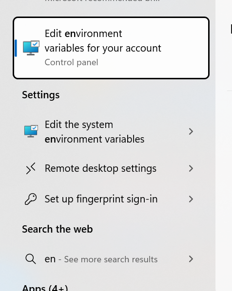

# aggie-unterprise

This document is intended to be read on [github](https://github.com/dave-doty/aggie-unterprise#readme). Some of what appears below does not render properly on other websites such as pypi.org.

## Table of contents

* [Overview](#overview)
* [Installation](#installation)
* [Examples](#examples)

## Overview
This is an example of a useful summary of research grant funds:

### Totals for August 2024
| Project Name                       |     Expenses |       Salary |      Travel |   Supplies |      Fringe |   Fellowship |     Indirect |      Balance |       Budget |
|------------------------------------|--------------|--------------|-------------|------------|-------------|--------------|--------------|--------------|--------------|
| INDIRECT COST RETURN               |       \$0.00 |       \$0.00 |      \$0.00 |     \$0.00 |      \$0.00 |       \$0.00 |       \$0.00 |     \$904.00 |     \$904.00 |
| DISCRETIONARY FUNDS                |       \$0.00 |       \$0.00 |      \$0.00 |     \$0.00 |      \$0.00 |       \$0.00 |       \$0.00 |   \$2,500.00 |   \$2,500.00 |
| NSF Engineering DNA and RNA        |  \$61,316.61 |  \$34,800.00 |      \$0.00 |   \$133.40 |  \$3,263.70 |       \$0.00 |  \$23,119.51 | \$318,683.39 | \$380,000.00 |
| NSF CAREER Chemical Computation    | \$468,000.72 | \$211,746.21 | \$33,334.25 | \$8,847.54 | \$58,519.35 |   \$5,166.81 | \$150,386.56 |  \$17,180.28 | \$485,181.00 |
| REU CAREER Chemical Computation    |  \$44,062.63 |  \$43,180.29 |      \$0.00 |     \$0.00 |    \$882.34 |       \$0.00 |       \$0.00 |  \$18,750.37 |  \$62,813.00 |
| DOE Office of Science Basic Energy |  \$15,045.49 |   \$8,642.86 |      \$0.00 |     \$0.00 |    \$760.57 |       \$0.00 |   \$5,642.06 |  \$51,372.51 |  \$66,418.00 |

[AggieEnterprise](https://aggieenterprise.ucdavis.edu/) is a software system used by [UC Davis](https://www.ucdavis.edu/), whose purpose is bury this useful information beneath mountains of gibberish, resulting in a spreadsheet filled with useless trash like this:


The aggie_unterprise Python package helps you, the **AGGIE**, to **UN**do this en**TERPRIS**ing feat. It sifts through the trash to find the important data related to your grants.


## Installation

There are two options:

### pip (the easy way)

At the command line, type `pip install aggie_unterprise`. This assumes you have [Python](https://www.python.org/) and [pip](https://pip.pypa.io/en/stable/installation/) installed.

### The less easy way in case pip installation doesn't work

Clone the repo and use as a local package.

1. **Install dependencies**: Type `pip install openpyxl tabulate` at the command line.

2. **Clone the repo**: `git clone https://github.com/dave-doty/aggie-unterprise.git`

3. **Add to PYTHONPATH**: Assuming for example that you cloned the repository to the directory `C:\git\aggie-enterprise`, add the directory to your PYTHONPATH. In Windows this is done by going to settings and searching for "Environment Variables":\
\
and editing or adding (if necessary) a variable named PYTHONPATH with value `C:\git\aggie-enterprise`:\
\
In Linux/Mac, using the bash shell, this can be done by adding the line `PYTHONPATH=$PYTHONPATH:/mnt/c/git/aggie-enterprise` to the file `.bashrc` in your home directory.

4. **Test**: Open a Python interpreter or Jupyter notebook and type `import aggie_unterprise`; it should import without errors.


## Examples
Suppose you have generated a spreadsheet from AggieEnterprise named `2024-8-1.xlsx` following [these instructions](https://servicehub.ucdavis.edu/servicehub?id=ucd_kb_article&sys_id=cc1942f61b32c6d80e0b2068b04bcbbf). The following code:

```python
from aggie_unterprise import Summary
summary = Summary.from_file('2024-8-1.xlsx')
print(f'Totals for {summary.month()} {summary.year()}\n{summary}')
```

will print something like this:

```
Totals for August 2024
╭────────────────────────────────────┬─────────────┬─────────────┬────────────┬────────────┬────────────┬──────────────┬─────────────┬─────────────┬─────────────╮
│ Project Name                       │    Expenses │      Salary │     Travel │   Supplies │     Fringe │   Fellowship │    Indirect │     Balance │      Budget │
├────────────────────────────────────┼─────────────┼─────────────┼────────────┼────────────┼────────────┼──────────────┼─────────────┼─────────────┼─────────────┤
│ INDIRECT COST RETURN               │       $0.00 │       $0.00 │      $0.00 │      $0.00 │      $0.00 │        $0.00 │       $0.00 │     $904.00 │     $904.00 │
│ DISCRETIONARY FUNDS                │       $0.00 │       $0.00 │      $0.00 │      $0.00 │      $0.00 │        $0.00 │       $0.00 │   $2,500.00 │   $2,500.00 │
│ NSF Engineering DNA and RNA        │  $61,316.61 │  $34,800.00 │      $0.00 │    $133.40 │  $3,263.70 │        $0.00 │  $23,119.51 │ $318,683.39 │ $380,000.00 │
│ NSF CAREER Chemical Computation    │ $468,000.72 │ $211,746.21 │ $33,334.25 │  $8,847.54 │ $58,519.35 │    $5,166.81 │ $150,386.56 │  $17,180.28 │ $485,181.00 │
│ REU CAREER Chemical Computation    │  $44,062.63 │  $43,180.29 │      $0.00 │      $0.00 │    $882.34 │        $0.00 │       $0.00 │  $18,750.37 │  $62,813.00 │
│ DOE Office of Science Basic Energy │  $15,045.49 │   $8,642.86 │      $0.00 │      $0.00 │    $760.57 │        $0.00 │   $5,642.06 │  $51,372.51 │  $66,418.00 │
╰────────────────────────────────────┴─────────────┴─────────────┴────────────┴────────────┴────────────┴──────────────┴─────────────┴─────────────┴─────────────╯
```

The table summarizes expenses, broken down by type of expense, remaining balance, and original total budget, for each grant. These are the totals since the start of each grant. 

Since we sometimes care about monthly spending, we may want to know the *differences* between months, to indicate for instance, how much money was spent during July (e.g., $800 total spent by August - $600 total spent by July = $200 spent *during* July). The method `Summary.diff_table` gives this information:

```python
from aggie_unterprise import Summary
summary_aug = Summary.from_file('2024-8-1.xlsx')
summary_jul = Summary.from_file('2024-7-1.xlsx')
print(f'Difference between {summary_aug.month()} and {summary_jul.month()}')
print(f'{summary_aug.diff_table(summary_jul)}')
```

```
Difference between August and July
╭────────────────────────────────────┬────────────┬────────────┬───────────┬────────────┬───────────┬──────────────┬────────────┬──────────────╮
│ Project Name                       │   Expenses │     Salary │    Travel │   Supplies │    Fringe │   Fellowship │   Indirect │      Balance │
├────────────────────────────────────┼────────────┼────────────┼───────────┼────────────┼───────────┼──────────────┼────────────┼──────────────┤
│ INDIRECT COST RETURN               │      $0.00 │      $0.00 │     $0.00 │      $0.00 │     $0.00 │        $0.00 │      $0.00 │        $0.00 │
│ DISCRETIONARY FUNDS                │      $0.00 │      $0.00 │     $0.00 │      $0.00 │     $0.00 │        $0.00 │      $0.00 │        $0.00 │
│ NSF Engineering DNA and RNA        │ $32,401.41 │ $18,300.00 │     $0.00 │     $13.40 │ $1,811.70 │        $0.00 │ $12,276.31 │ ($32,401.41) │
│ NSF CAREER Chemical Computation    │ $14,347.87 │  $5,275.73 │ $3,504.27 │  $2,458.96 │   $100.24 │  ($3,826.31) │  $6,834.98 │   $62,178.13 │
│ REU CAREER Chemical Computation    │      $0.00 │      $0.00 │     $0.00 │      $0.00 │     $0.00 │        $0.00 │      $0.00 │        $0.00 │
│ DOE Office of Science Basic Energy │      $0.00 │      $0.00 │     $0.00 │      $0.00 │     $0.00 │        $0.00 │      $0.00 │        $0.00 │
╰────────────────────────────────────┴────────────┴────────────┴───────────┴────────────┴───────────┴──────────────┴────────────┴──────────────╯
```

In the diff table, one would normal expect each entry under Balance (which represents a change in balance from July to August) to be the negative of the entry under Expenses (total amount of expenses between July and August), as in the project "NSF Engineering DNA and RNA". However, sometimes a grant agency will deposit new funds in between the dates (as happened in the "NSF CAREER Chemical Computation" entry above), so the change in balance and change in expenses are not always negatives of each other.

You can also render the tables in Markdown in a Jupyter notebook, so they will appear similar to the first table shown at the top of this document. When you print/stringify a `Summary`, it calls a method called `table` (so `f'{summary}'` is equivalent to `f'{summary.table()}'`), which, along with the method `diff_table`, can take the `tablefmt` argument with value `'github'` to render the table appropriately for Markdown (`'github'` means ["GitHub-flavored Markdown"](https://github.github.com/gfm/), which [Jupyter](https://jupyter.org/) can render nicely):

```python
from aggie_unterprise import Summary, summary_diff_table, summary_table

summary_aug = Summary.from_file('2024-8-5.xlsx')
summary_jul = Summary.from_file('2024-7-11.xlsx')

from IPython.display import display, Markdown
display(Markdown(f"""\
### Totals for {summary_aug.month()}
{summary_aug.table(tablefmt='github')}
### Totals for {summary_jul.month()}
{summary_jul.table(tablefmt='github')}
### Difference between {summary_aug.month()} and {summary_jul.month()}
{summary_aug.diff_table(summary_jul, tablefmt='github')}
"""))
```

In general, you can pass any value to `tablefmt` that the [tabulate](https://pypi.org/project/tabulate/) package expects in its function tabulate: https://github.com/astanin/python-tabulate?tab=readme-ov-file#table-format.

Finally, you can customize a bit how to clean up project names. They are taken either from the column named "Project Name" in the spreadsheet, unless that name has the substring `"PPM Only"` in it, which generally appear in internal/department-specific (i.e., non-sponsored) funds like startup grants or indirect cost return, and are identical (for the CS department for me, they are all named "David Doty ENGR COMPUTER SCIENCE PPM Only"). For these funds we instead use the column "Task/Subtask Name" (which is useless for normal grants since it just says "TASK01", but is a bit more informative for department-specific funds, such as "INDIRECT COST RETURN" and "DISCRETIONARY FUNDS" above).

To clean up the project names, you can specify two arguments to the `Summary.from_file` method: `substrings_to_clean` and `suffixes_to_clean`. Any substring appearing in `substrings_to_clean` will be removed, for example if I set `substrings_to_clean=['CS', 'Doty']`, it will change the project name `"CS NSF Engineering DNA and RNA Doty K302325F33"` to `"NSF Engineering DNA and RNA  K302325F33"`. Anything in `suffixes_to_clean` will be removed, not only that substring, but the entire rest of the name. For instance, if I set `suffixes_to_clean=['K3023']`, it will change `"NSF Engineering DNA and RNA  K302325F33"` to `"NSF Engineering DNA and RNA"`.

I personally use them like this:
```python
suffixes = ['K3023', 'DOTY DEFAULT PROJECT 13U00']
substrings = ['Doty', 'CS ']
summary_aug = Summary.from_file('2024-8-1.xlsx', substrings_to_clean=substrings, suffixes_to_clean=suffixes)
```
due to the particular manner in which someone mashed their forearm against the keyboard to generate the alien-looking project names of my own grants (e.g. "*CS NSF DNA and RNA Partic Support Doty K3023EDRNA*"), but you will want to customize according to the shape of your SPO representative's forearm.

